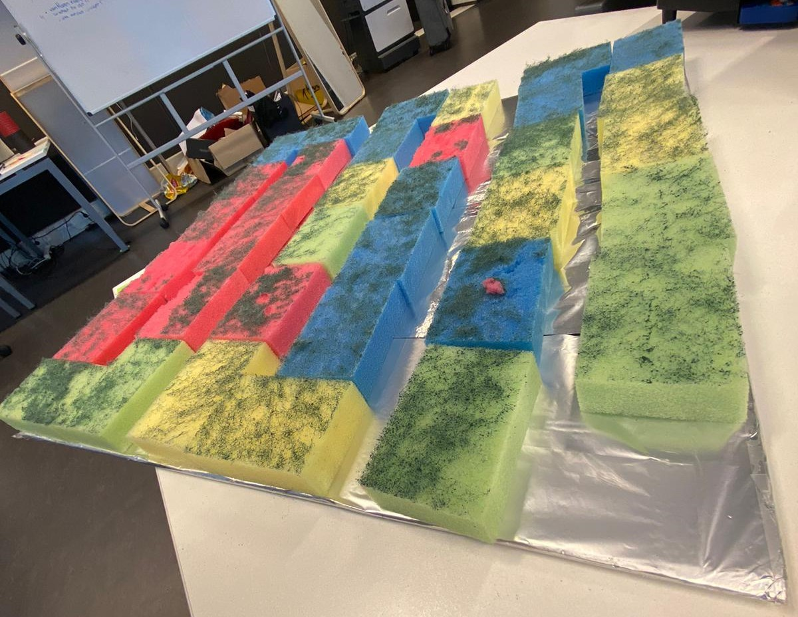
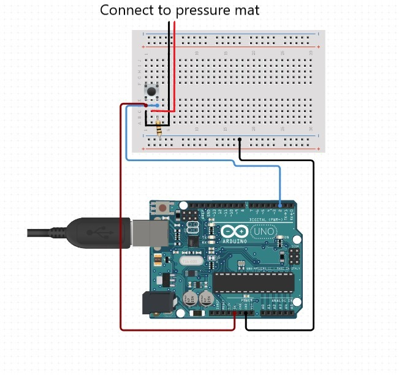
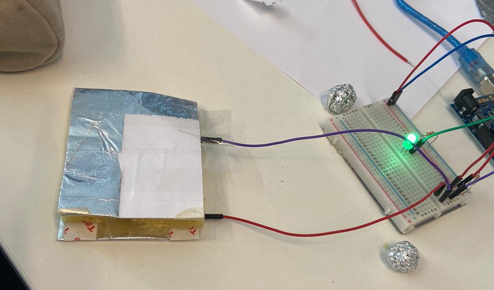
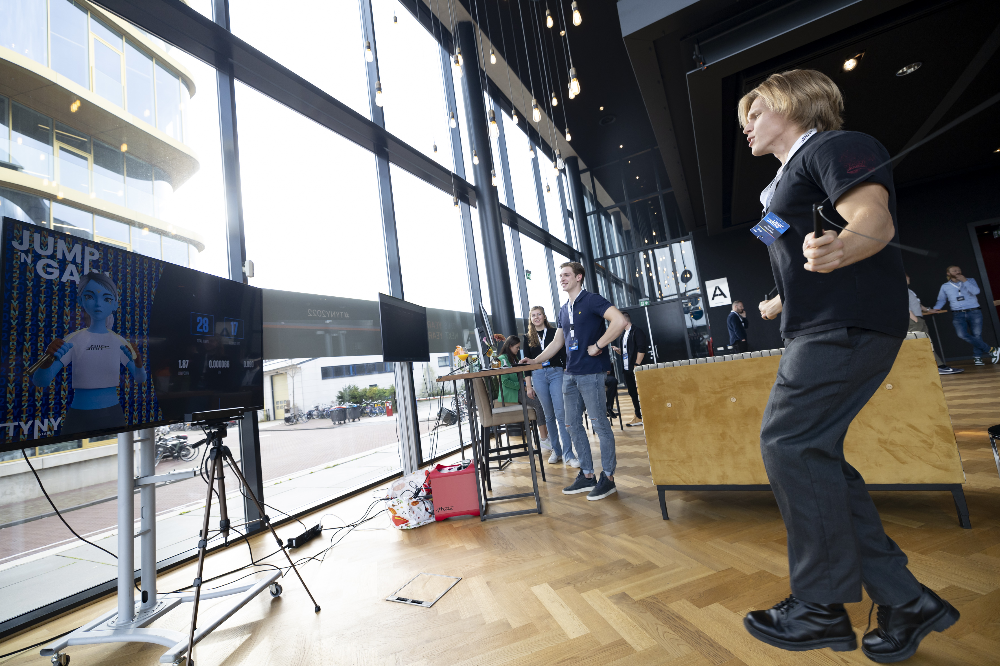

# prototypesGreenHouse - Jump'n Gain

- [prototypesGreenHouse - Jump'n Gain](#prototypesgreenhouse---jumpn-gain)
  - [Klonen](#klonen)
  - [Installeren](#installeren)
    - [Arduino](#arduino)
    - [Kinect](#kinect)
  - [Gebruik](#gebruik)
  - [Voorbeeld - Arduino](#voorbeeld)


# Klonen

Om dit project te kunnen gebruik zal er eers een clone van het poject gemaakt moeten worden.

- Kloon de repository naar je lokale machine `https://github.com/rickkert1999/prototypesGreenHouse.git`
  of
- Download de zip van `https://github.com/rickkert1999/prototypesGreenHouse`

# Installeren - Arduino/Kinect

Om het Jump'n Gain prototype te ervaren zijn er twee technieken uitgeprobeerd. Het eerste is samen met een Arduino en een druk mat van sponzen en aluminium folie. En als tweede is er een prototype uitgewerkt met behulp van een Kinect. 

Kies je gewenste techniek en volg hieronder de stappen.

## Arduino: 

1. Navigeer naar juiste map in de terminal:
  
    ```bash
    cd ProtypeJumpingRope
    ``` 

2. Pull packages via de terminal:
   
    ```bash
    npm i (socket.io, express, serialport)
    ```

3. Upload Arduino code 
   
   Connect de Arduino en upload het bestand ArduinoPrototypeDebounce.ino naar de Arduino (terug te vinden in `ProtypeJumpingRope/Arduino/ArduinoPrototypeDebounce`).

4. Druk mat
   
   1. Pak twee stukken karton van 50cm bij 50cm
   2. Omhul deze volledig met aluminiumfolie
   3. Plak sponzen op het aluminiumfolie van een van je kartonnen stukken zodat het vlag omhoog veert als er op gesprongen wordt
   4. Plak het tweede stuk karton met het aluminiumfolie tegen de sponzen aan
   5. Pak een twee tal Arduino draden en plak aan buide kartonnen (op het aluminium) een draad vast. 
   
   <br>

   Zet de arduino op zo als in de volgende afbeelding wordt aangegeven.
   
   
   Figuur 1. voorbeeld van de druk mat met sponzen

5. Arduino circuit

   Zet de arduino op zo als in de volgende afbeelding wordt aangegeven.
   
   
   Figuur 2. Arduino circuit
   
   
   
   Figuur 3. Arduino met kleine druk mat

## Kinect

1. Navigeer naar juiste map in de terminal:
  
    ```bash
    cd ProtypeJumpingRopeKinect
    ``` 

2. Pull packages via de terminal:
   
    ```bash
    npm i (socket.io, express, kinect2)
    ```

3. Instaleer Kinect SDK

   Ga naar de volgende [link](https://www.microsoft.com/en-us/download/details.aspx?id=44561), download de Kinect SDK en installeer deze.

4. Verbind Kinect
   
   Verbind nu de Kinect met je laptop en zorg ervoor dat je hem ongeveer op 2 meter aftand zet van de plek waar gesprongen zal worden.

# Gebruik

Voor beide opties is een `Node.js` server gemaakt die gestart kan worden met het volgende commando:

```
node .\server.js
```
Na het starten van de server zal het prototype klaar zijn op te gebruiken. Let op! Bij het Kinect prototype zal je drie seconde op de zelfde plek moeten staan voordat je begint met springen.

# Voorbeeld



Figuur 4. Het Jump'n Gain Prototype in actie
